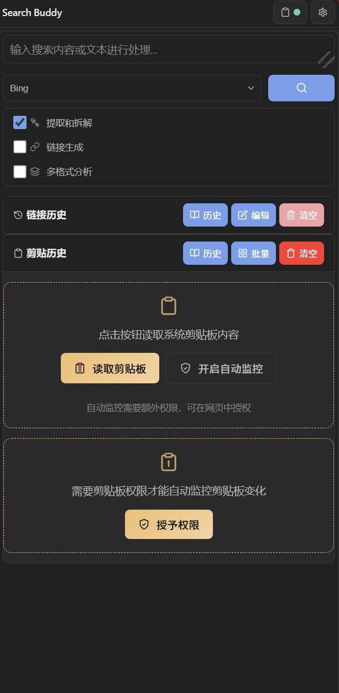
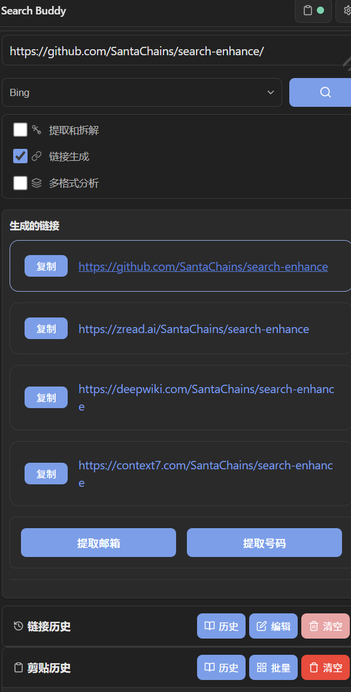
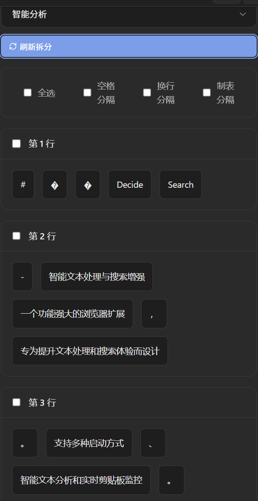
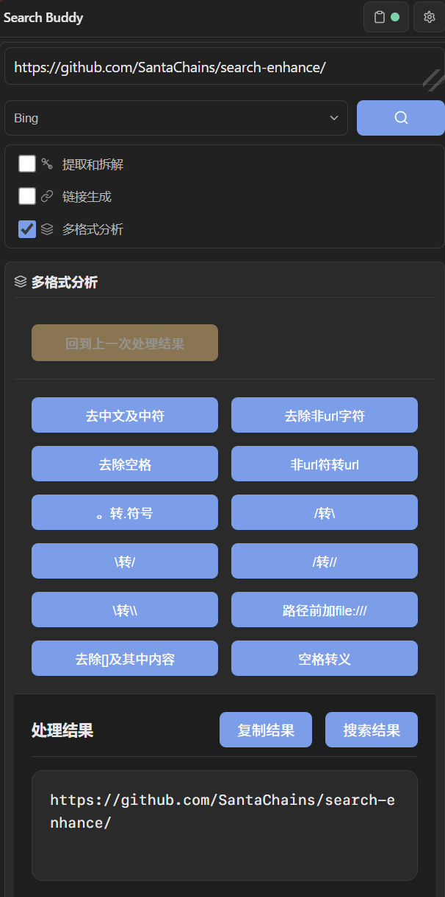

# 🎯 Decide Search - 智能文本处理与搜索增强

一个功能丰富的浏览器扩展，专为提升文本处理和搜索效率而设计。支持多种文本分析模式、智能链接生成和剪贴板历史管理。

兼容 Microsoft Edge 和 Google Chrome 浏览器。

---

## ✨ 核心特性

### 🚀 多种启动方式

- **快捷键启动**：按 `Alt+L` 快速打开扩展弹窗
- **工具栏图标**：点击浏览器扩展图标打开
- **侧边栏模式**：右键扩展图标选择"在侧边栏中打开"
- **剪贴板快捷键**：`Alt+K` 切换剪贴板监控，`Alt+J` 读取剪贴板内容



---

### 🔧 智能文本处理

#### 路径转换
自动识别 Windows 路径并转换为多种格式：

| 转换类型 | 输出示例 | 适用场景 |
|---------|---------|---------|
| **原始路径** | `D:\Users\Name\file.txt` | 保持原样 |
| **Unix 路径** | `/d/Users/Name/file.txt` | WSL/Linux 使用 |
| **转义路径** | `D:\\Users\\Name\\file.txt` | 编程字符串 |
| **File URL** | `file:///D:/Users/Name/file.txt` | 浏览器打开 |

#### 链接生成
输入 `用户名/仓库名` 或 GitHub 链接，自动生成多平台 Wiki 链接：



支持的平台：
- **GitHub** - 源码仓库
- **ZRead** - AI 阅读分析
- **DeepWiki** - 文档 Wiki
- **Context7** - 代码分析

#### 文本拆分
提供 10 种分析模式，满足不同场景需求：

| 模式 | 功能描述 |
|------|---------|
| **智能分析** | 自动识别中英文、数字、路径、URL，采用不同分词策略 |
| **中文分析** | 基于字典的中文分词，支持中英分离 |
| **英文分析** | 支持驼峰、蛇形、短横线命名法分词 |
| **代码分析** | 识别 Python/C++ 代码结构，按逻辑块分割 |
| **整句分析** | 按换行和结束标点分割 |
| **半句分析** | 按主要标点分割 |
| **去除符号** | 去除所有符号后分词 |
| **字符断行** | 按设定字符数硬断行 |
| **随机分词** | 随机长度分词（用于测试） |
| **AI 分析** | 调用 AI API 进行严格分词（需配置 API Key） |



#### 多规则链式处理
支持 11 个独立规则的自由组合，按顺序依次处理：

**分词规则**：符号分词、空格分词、换行分词、中英分词、大写分词、命名分词、数字分词

**去除规则**：去除空格、去除符号、去除中文、去除英文



**链式处理特点**：
- 每个规则的输出作为下一个规则的输入
- 支持规则冲突检测和自动处理
- 可查看操作历史，支持撤销和重置

---

### 📋 剪贴板管理

#### 剪贴板监控
- **实时监控**：自动检测剪贴板内容变化
- **智能填充**：检测到新内容时自动填入搜索框
- **权限管理**：首次使用需授予剪贴板读取权限

#### 剪贴板历史
- **自动分类**：根据内容类型自动打标签（URL、代码、中文、英文、多行）
- **全文搜索**：支持搜索内容、预览文本和标签
- **批量操作**：支持多选、批量复制、批量删除
- **导入导出**：支持 JSON、CSV、TXT 格式

#### 链接历史
- **自动记录**：自动保存生成的链接和搜索查询
- **搜索引擎识别**：支持 Google、Bing、百度、DuckDuckGo 等 8 大搜索引擎
<!-- - **统计报表**：查看访问最多的域名和热门搜索词 -->

---

## 🛠️ 安装方法

### 快速安装

1. 打开 Edge 浏览器，访问 `edge://extensions/`
2. 开启"开发人员模式"
3. 点击"加载解压缩的扩展"
4. 选择项目根目录并确认

### 其他浏览器

- **Google Chrome**：访问 `chrome://extensions/`，开启开发者模式后加载扩展
- **其他 Chromium 浏览器**：类似步骤加载扩展

---

## 📖 使用指南

### 基本操作

1. **启动扩展**：按 `Alt+L` 或点击扩展图标打开弹窗
2. **打开侧边栏**：点击扩展图标右键选择"在侧边栏中打开"，或按 `Alt+J` 直接打开侧边栏并读取剪贴板内容
3. **输入文本**：在搜索框中输入或粘贴内容
4. **选择功能**：通过开关选择所需的处理方式
5. **查看结果**：在结果区域查看处理后的内容
6. **一键复制**：点击复制按钮获取结果

**快捷操作提示**：
- `Alt+L`：打开扩展弹窗
- `Alt+J`：打开侧边栏并自动读取剪贴板内容
- `Alt+K`：切换剪贴板监控状态

### 三大核心功能

#### 🔄 提取和拆解

- **路径处理**：自动识别 Windows 路径并转换为多种格式
- **链接提取**：从文本中提取所有 URL 链接
- **文本清洗**：去除中文字符、标点符号，规范化文本
- **智能拆分**：10 种拆分模式，可视化选择和批量复制

#### 🔗 链接生成

- **仓库识别**：自动识别 `用户名/仓库名` 格式
- **多平台生成**：一键生成 GitHub、ZRead、DeepWiki、Context7 链接
- **反向解析**：输入任一平台链接，生成其他平台对应链接
- **链接历史**：自动记录生成的链接，方便后续使用

#### 📊 多格式分析

- **格式检测**：自动识别路径、链接、邮箱、电话等格式
- **链式处理**：通过按钮对结果进行连续处理
- **统一显示**：卡片式布局展示所有结果
- **批量操作**：支持多选和批量复制

---

## ⚙️ 设置选项

通过设置页面（点击齿轮图标），您可以：

- 🔍 **搜索引擎管理**：添加、删除、修改搜索引擎，设置默认引擎
- 📚 **历史记录设置**：配置剪贴板历史和链接历史的最大保存条数
- 📋 **剪贴板监控**：启用/禁用自动监控，配置监控选项
- 🤖 **AI 设置**：配置 AI 服务商和 API Key（可选功能）
- 📤 **配置导入导出**：备份和恢复扩展配置

### AI 功能配置（可选）

扩展支持接入多种 AI 服务商进行智能分词：

**支持的服务商**：
- OpenAI（GPT-4o、GPT-3.5-turbo）
- Claude（Anthropic）
- Gemini（Google）
- 国内：智谱 AI、百度文心、阿里通义、DeepSeek、SiliconFlow
- Ollama（本地部署）

**注意**：AI 功能需要用户自行配置 API Key 才能使用。

---

## 🏗️ 技术架构

### 项目结构

```
search-enhance/
├── icons/                  # 扩展图标
├── src/
│   ├── background/         # 后台服务脚本
│   │   └── background.js
│   ├── content/            # 内容脚本
│   │   └── content.js
│   ├── popup/              # 弹窗界面
│   │   ├── index.html
│   │   ├── main.js         # 主逻辑（约 3800 行）
│   │   ├── style.css
│   │   └── new-style.css
│   ├── settings/           # 设置页面
│   │   ├── settings.html
│   │   └── settings.js
│   └── utils/              # 工具模块
│       ├── textProcessor.js      # 文本处理核心（约 1300 行）
│       ├── multiRuleAnalyzer.js  # 多规则分析器
│       ├── aiAdapter.js          # AI 适配器
│       ├── codeAnalyzer.js       # 代码分析器
│       ├── storage.js            # 存储管理
│       ├── linkHistory.js        # 链接历史管理
│       ├── clipboardHistory.js   # 剪贴板历史管理
│       └── logger.js             # 日志工具
├── manifest.json           # 扩展配置（Manifest V3）
├── package.json
├── test.html               # 功能测试页面
└── README.md
```

### 技术栈

| 类别 | 技术 | 说明 |
|-----|------|------|
| **标准** | Manifest V3 | Chrome 扩展最新标准 |
| **语言** | ES6+ JavaScript | 现代 JavaScript 特性 |
| **模块** | ES6 Modules | 模块化代码组织 |
| **存储** | Chrome Storage API | 本地持久化存储 |
| **样式** | CSS3 + 变量 | 现代化样式系统 |

### 核心模块说明

#### textProcessor.js
文本处理核心模块，实现 10 种分析模式：
- 智能内容类型检测（正则匹配）
- 路径识别和转换
- 命名法分词（驼峰、蛇形、短横线）
- 中文分词（基于 fastCWS 字典算法）

#### multiRuleAnalyzer.js
多规则分析器，实现 11 个独立规则：
- 规则冲突检测
- 顺序执行引擎
- 操作历史记录和撤销

#### aiAdapter.js
AI 适配器，支持多服务商：
- 统一的 API 接口
- 自动重试机制
- 链接识别和补全

---

## 📝 功能限制说明

### 代码分析限制
- 仅支持 Python 和 C++ 的简单结构分析
- 不支持 JavaScript、Java 等其他语言

### AI 功能限制
- 需要用户自行申请和配置 API Key
- 受限于 AI 服务商的可用性和配额

### 剪贴板监控限制
- 需要用户授予剪贴板读取权限
- 部分浏览器可能有额外的安全限制

---

## 🧪 测试

打开 `test.html` 进行功能测试：

```bash
# 启动本地服务器
npx serve .

# 访问测试页面
open http://localhost:3000/test.html
```

---

## 📊 版本历史

### v2.2.0 (2026-02-08)

- ✨ 新增剪贴板历史管理模块
- ✨ 链接历史支持搜索引擎识别
- 🔧 优化多规则组合功能
- 🐛 修复符号分词问题

### v2.1.0 (2026-01-15)

- ✨ 新增平滑拖拽功能
- ✨ 新增中文分词功能
- ✨ 新增批量操作功能
- 🎨 优化响应式布局
- 🔧 增强剪贴板监控

### v2.0.0 (2025-12-01)

- 🎯 完整功能实现
- 🌐 界面完全中文化
- 📊 多格式同步分析
- 📋 剪贴板监听功能

---

## 🤝 贡献指南

欢迎提交 Issue 和 Pull Request！

### 开发环境设置

```bash
# 克隆项目
git clone https://github.com/SantaChains/search-enhance.git

# 进入项目目录
cd search-enhance

# 在 Edge/Chrome 中加载扩展进行测试
```

### 代码规范

- 使用 ES6+ 语法
- 函数添加中文注释说明功能、参数、返回值
- 保持代码模块化
- 添加适当的错误处理

---

## 📄 许可证

MIT License - 详见 [LICENSE](LICENSE) 文件

---

## 📞 支持与反馈

- 📧 **Email**: chains0521@163.com
- 🐛 **Issues**: [GitHub Issues](https://github.com/SantaChains/search-enhance/issues)

---

<p align="center">
  <strong>Made with ❤️ by SantaChains</strong>
</p>

<p align="center">
  最后更新：2026年3月8日 | 版本：v2.2.0
</p>
